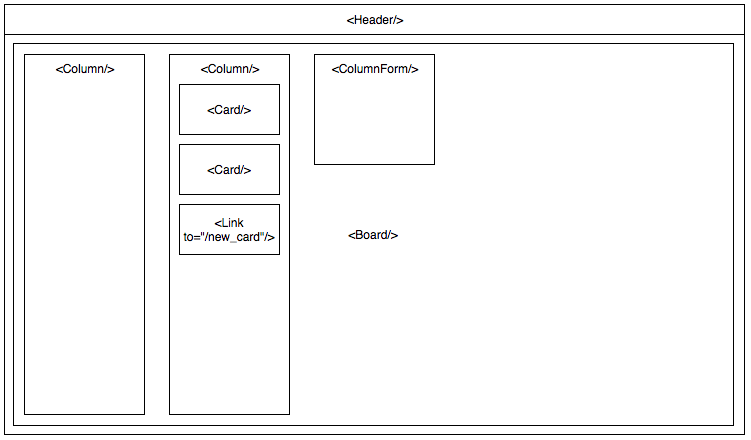

# React Trello

Let's create a Trello clone using react!. Follow this components architecture:



Use bootstrap:

https://facebook.github.io/create-react-app/docs/adding-bootstrap

Create a service to fetch Trello API data:

```
# src/services/TrelloService.js

import axios from 'axios';

const http = axios.create({
  baseURL: 'http://localhost:3001'
});

const getColumns = () => http.get('/columns').then(response => response.data);

export default {
  getColumns
};
```
